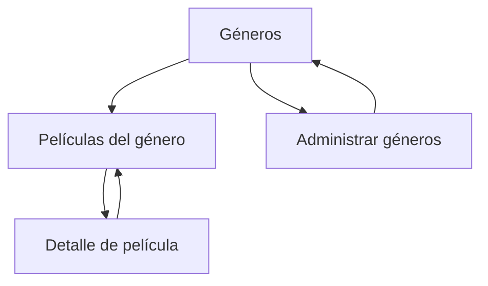

# CineExplorer

> Aplicación Android para explorar películas por género y consultar su información principal.  
> **Autor:** Cristian Javier Jamaica  
> **Curso:** COM-437 Desarrollo de Aps Móviles  
> **Institución:** Saint Leo University  
> **Versión actual:** 0.2.1  
> **Última actualización:** 22 de septiembre de 2026

## Tabla de contenido

1. [Descripción del proyecto](#descripción-del-proyecto)
2. [Exposición del problema](#exposición-del-problema)
3. [Objetivos](#objetivos)
4. [Fundamento técnico](#fundamento-técnico)
5. [Plataforma y tecnologías](#plataforma-y-tecnologías)
6. [Interfaz de usuario y administración](#interfaz-de-usuario-y-administración)
7. [Funcionalidad implementada](#funcionalidad-implementada)
8. [Integración con TMDB](#integración-con-tmdb)
9. [Diseño y wireframes](#diseño-y-wireframes)
10. [Arquitectura y estructura](#arquitectura-y-estructura)
11. [Instalación y ejecución](#instalación-y-ejecución)
12. [Pruebas](#pruebas)
13. [Registro de cambios](#registro-de-cambios)
14. [Alcance y trabajo pendiente](#alcance-y-trabajo-pendiente)
15. [Referencias](#referencias)

## Descripción del proyecto

**CineExplorer** es una aplicación Android que permite explorar películas a partir de sus géneros. La pantalla inicial presenta categorías cinematográficas como acción, aventura, animación, comedia, drama, terror y ciencia ficción. Cuando el usuario selecciona un género, la aplicación consulta y presenta las películas correspondientes en una cuadrícula. Al tocar una película, se abre una ficha con el título, año de estreno, géneros, director, sinopsis, reparto principal, duración, calificación y póster.

La información se obtiene de **The Movie Database (TMDB)** mediante su API. La aplicación es informativa: no reproduce, descarga ni distribuye películas. La versión actual implementa el recorrido completo entre géneros, listado y detalle, además de una configuración local para controlar los géneros visibles.

## Exposición del problema

Las personas interesadas en el cine pueden tener dificultades para descubrir películas de un género específico y consultar rápidamente sus datos principales. Los buscadores generales suelen mezclar noticias, videos, publicidad, servicios de transmisión y otros contenidos. Como consecuencia, el usuario debe abrir varias páginas para conocer datos básicos como el año, el director o la sinopsis de una película.

CineExplorer atiende este problema mediante un recorrido directo: **seleccionar un género, consultar sus películas y abrir la ficha del título elegido**. Este enfoque reduce pasos innecesarios y organiza la información según una categoría que el usuario reconoce. El uso de una API separa el catálogo del código y permite trabajar con información cinematográfica real y actualizable.

La tesis que orienta el proyecto es que una navegación jerárquica y una presentación consistente de los datos reducen el esfuerzo requerido para explorar un catálogo cinematográfico. La interfaz aplica jerarquía visual, retroalimentación durante las consultas y mensajes recuperables ante los errores. Estas decisiones coinciden con los principios de visibilidad del estado del sistema, consistencia y prevención de errores propuestos por Nielsen (2024).

## Objetivos

### Objetivo general

Desarrollar en Android Studio una aplicación móvil que permita explorar películas por género y consultar información detallada de cada título mediante la API de TMDB.

### Objetivos específicos

- Obtener y mostrar la lista de géneros cinematográficos de TMDB.
- Consultar las películas asociadas con el género seleccionado.
- Mostrar título, póster, año y calificación en cada tarjeta de película.
- Presentar una ficha con géneros, director, sinopsis, reparto, duración y calificación.
- Implementar navegación entre géneros, listado y detalle.
- Incluir estados de carga, error y ausencia de resultados.
- Permitir que una configuración administrativa local determine los géneros visibles.
- Mantener el token de TMDB fuera del repositorio público.
- Documentar el avance mediante un registro de cambios verificable.

## Fundamento técnico

La solución adopta una separación entre interfaz, estado y acceso a datos. Android Developers (2026a) recomienda una arquitectura organizada por capas y un flujo de datos predecible para mejorar la capacidad de prueba y mantenimiento. Por esta razón, las pantallas de CineExplorer observan estados administrados por `ViewModel`, mientras que `MovieRepository` concentra el acceso a la API.

Jetpack Compose se utiliza para construir una interfaz declarativa. En este modelo, la pantalla representa el estado actual y vuelve a componerse cuando cambia la información (Android Developers, 2026b). Este principio facilita la representación explícita de cuatro condiciones importantes: carga, contenido disponible, ausencia de resultados y error recuperable.

Las preferencias de géneros se almacenan con DataStore. Esta biblioteca ofrece una API basada en corrutinas y flujos para persistir conjuntos pequeños de configuración (Android Developers, 2026c). La información cinematográfica no se guarda ni se modifica localmente porque TMDB continúa siendo la fuente externa de los datos.

## Plataforma y tecnologías

| Elemento | Selección | Uso en el proyecto |
|---|---|---|
| Plataforma | Android, API mínima 24 | Ejecución en teléfonos y emuladores Android |
| Entorno | Android Studio | Edición, compilación, emulación y depuración |
| Lenguaje | Kotlin | Lógica de la aplicación y modelos de datos |
| Interfaz | Jetpack Compose y Material 3 | Pantallas, tarjetas, cuadrículas y estados |
| Arquitectura | MVVM | Separación entre UI, estado y repositorio |
| Navegación | Navigation Compose | Flujo entre géneros, listado, detalle y administración |
| Red | Retrofit, OkHttp y corrutinas | Solicitudes HTTP y conversión de JSON |
| Imágenes | Coil | Carga de pósteres remotos |
| Preferencias | DataStore | Persistencia de géneros visibles y destacado |
| Control de versiones | Git y GitHub Classroom | Historial, publicación y entrega |

No se incorporan autenticación, Firebase, chat, pagos, reproducción de películas ni sincronización entre dispositivos. Estas funciones no son necesarias para demostrar el concepto central.

## Interfaz de usuario y administración

La interfaz sigue un flujo de tres niveles:

1. **Géneros:** categorías cinematográficas disponibles.
2. **Películas del género:** cuadrícula con póster, título, año y calificación.
3. **Detalle:** información ampliada de la película seleccionada.

La pantalla de administración es una configuración local, no un sistema de usuarios. Permite activar o desactivar géneros, marcar uno como destacado, guardar la selección y restaurar los valores predeterminados. Siempre se conserva al menos un género visible. La selección permanece en el dispositivo mediante DataStore.

Las consultas presentan un indicador de carga. Cuando la red no está disponible, el token es rechazado o la API no devuelve resultados, la aplicación muestra un mensaje comprensible y una acción de reintento. De esta manera, un error no provoca el cierre de la aplicación.

## Funcionalidad implementada

### Funciones del usuario

- Consultar los géneros obtenidos de TMDB.
- Abrir un género y ver las películas asociadas.
- Cargar otra página de resultados sin duplicar las películas ya visibles.
- Consultar título, año, géneros, director, sinopsis, reparto, duración, calificación y póster.
- Regresar al listado o cambiar de género.
- Reintentar una consulta cuando ocurre un error.

### Funciones administrativas

- Consultar todos los géneros disponibles.
- Activar o desactivar géneros en la pantalla principal.
- Elegir un género destacado, que aparecerá primero.
- Guardar la configuración local.
- Restaurar todos los géneros.

### Reglas principales

- La pantalla inicial muestra únicamente los géneros activados.
- La selección de un género determina la consulta enviada a TMDB.
- Cada película se identifica mediante el identificador asignado por TMDB.
- El director se obtiene de los créditos cuyo trabajo es `Director`.
- La ficha es informativa y no permite modificar los datos externos.
- El token de TMDB no se incluye en Git.
- Las consultas excluyen contenido para adultos.

## Integración con TMDB

CineExplorer utiliza la versión 3 de la API de TMDB. Retrofit transforma las respuestas JSON en modelos de Kotlin. Al abrir una película, el repositorio consulta sus detalles y créditos de forma concurrente para construir una sola ficha.

Endpoints utilizados:

```text
GET https://api.themoviedb.org/3/genre/movie/list
GET https://api.themoviedb.org/3/discover/movie?with_genres={genre_id}
GET https://api.themoviedb.org/3/movie/{movie_id}
GET https://api.themoviedb.org/3/movie/{movie_id}/credits
```

El token de lectura se envía en el encabezado `Authorization: Bearer ...`. Se configura exclusivamente en `local.properties`, archivo excluido mediante `.gitignore`.

> Este producto utiliza la API de TMDB, pero no está respaldado ni certificado por TMDB.

## Diseño y wireframes

Los wireframes representan el recorrido principal y la configuración administrativa.




Criterios visuales aplicados:

- Tarjetas amplias y legibles para seleccionar géneros.
- Cuadrícula de dos columnas para los pósteres.
- Título del género seleccionado en la barra superior.
- Ficha organizada por datos técnicos, créditos y sinopsis.
- Soporte para tema claro, oscuro y colores dinámicos.
- Controles identificados para visibilidad y género destacado.

## Arquitectura y estructura

```text
CineExplorer/
├── app/src/main/java/com/example/cineexplorer/
│   ├── data/
│   │   ├── model/          # Respuestas de TMDB y modelos de dominio
│   │   ├── remote/         # Retrofit, OkHttp y endpoints
│   │   ├── MovieRepository.kt
│   │   └── SettingsRepository.kt
│   ├── ui/
│   │   ├── screen/         # Pantallas Compose
│   │   ├── state/          # Estados de carga, éxito y error
│   │   ├── theme/          # Colores y tema Material 3
│   │   └── viewmodel/      # Estado y acciones de cada pantalla
│   └── MainActivity.kt
├── docs/                   # Wireframes y pruebas manuales
├── CHANGELOG.md            # Registro de cambios ampliado
└── README.md               # Informe y guía del proyecto
```

El flujo principal de datos es `Pantalla → ViewModel → Repository → API`. Las respuestas regresan al `ViewModel`, se convierten en estado observable y Compose actualiza la pantalla. Las preferencias siguen el flujo `Pantalla administrativa → ViewModel → SettingsRepository → DataStore`.

## Instalación y ejecución

### Requisitos

- Android Studio con JDK 17.
- Android SDK 35 instalado.
- Un emulador o dispositivo con Android 7.0 (API 24) o superior.
- Una cuenta de TMDB y un **API Read Access Token**.

### Configuración

1. Clone o descargue este repositorio y ábralo en Android Studio.
2. Espere a que Gradle sincronice las dependencias.
3. Abra el archivo `local.properties` que Android Studio crea en la raíz.
4. Agregue su token sin comillas:

   ```properties
   TMDB_BEARER_TOKEN=su_token_de_lectura
   ```

5. Seleccione un emulador o dispositivo y pulse **Run**.

También se incluye `local.properties.example` como referencia. Nunca se debe confirmar `local.properties` en GitHub.

### Solución al error de ruta con tildes en Windows

Si Android Studio muestra el mensaje `Your project path contains non-ASCII characters`, cierre el proyecto y muévalo a una ruta que no contenga tildes ni otros caracteres especiales, por ejemplo:

```text
C:\AndroidProjects\CineExplorer
```

Después, seleccione **File > Open**, abra la nueva carpeta y pulse **Sync Project with Gradle Files**. El proyecto también incluye `android.overridePathCheck=true` en `gradle.properties` como compatibilidad adicional, pero una ruta simple continúa siendo la opción más segura.

### Publicación del avance en GitHub

Desde la carpeta raíz del repositorio:

```bash
git add .
git commit -m "feat: implementar avance funcional de CineExplorer"
git push origin main
```

Después del envío, abra `README.md` en GitHub y copie su URL. Esa es la dirección que debe agregar al documento de entrega. Si la rama principal de GitHub Classroom tiene otro nombre, sustituya `main` por el nombre correspondiente.

## Pruebas

El proyecto incluye pruebas unitarias del mapeo de detalles y una lista de pruebas manuales en [`docs/PRUEBAS_MANUALES.md`](docs/PRUEBAS_MANUALES.md).

Comandos disponibles:

```bash
# Pruebas unitarias
./gradlew test

# Compilación de depuración
./gradlew assembleDebug
```

Los casos manuales cubren carga inicial, filtrado, detalle, paginación, persistencia, restauración, token inválido y pérdida de conexión.

## Registro de cambios

El registro sigue una adaptación de *Keep a Changelog* y utiliza versiones semánticas para diferenciar el borrador, el avance funcional y la entrega estable.

### Pasado — [0.1.0] — 26 de agosto de 2026

**Agregado**

- Definición del problema, objetivos y alcance del proyecto.
- Selección de Android Studio, Kotlin, Jetpack Compose, MVVM y TMDB.
- Diseño del flujo Géneros → Películas → Detalle.
- Wireframes de las cuatro pantallas principales.
- Reglas para mantener el token fuera del repositorio.

### Actual — [0.2.1] — 22 de septiembre de 2026

**Corregido**

- Se agregó compatibilidad con rutas de Windows que contienen caracteres no ASCII mediante `android.overridePathCheck=true`.
- Se documentó el procedimiento recomendado para mover el proyecto a una ruta sin tildes.

### Pasado — [0.2.0] — 22 de septiembre de 2026

**Agregado**

- Proyecto Android Studio con Gradle Kotlin DSL.
- Consumo de los cuatro endpoints previstos de TMDB.
- Pantallas funcionales de géneros, listado, detalle y administración.
- Navegación con parámetros de género y película.
- Paginación manual, carga de pósteres y mensajes de error.
- Persistencia de géneros visibles y destacado mediante DataStore.
- Tema Material 3 claro/oscuro y colores dinámicos.
- Pruebas unitarias del mapeo y guía de pruebas manuales.

**Cambiado**

- El documento dejó de describir solamente una propuesta y ahora refleja funciones implementadas.
- La ficha combina detalles y créditos para identificar al director y al reparto principal.
- El README incorpora instalación, estructura, pruebas y procedimiento de publicación.

**Seguridad**

- El token se obtiene de `local.properties`; este archivo está excluido de Git.
- El registro de red se limita al nivel básico durante depuración y se desactiva en la versión final.

### Futuro — [0.3.0] — Pendiente

- Ejecutar pruebas instrumentadas de navegación y estados de pantalla.
- Revisar contraste, escalado de texto y descripciones de accesibilidad.
- Validar el diseño en varios tamaños de pantalla y en un dispositivo físico.
- Incorporar una presentación vacía específica cuando TMDB no tenga póster.
- Corregir los defectos encontrados durante las pruebas finales.

### Futuro — [1.0.0] — Entrega final

- Congelar el alcance funcional.
- Completar la evidencia de pruebas.
- Actualizar la documentación final.
- Generar y verificar el APK de entrega.
- Publicar el código y el README finales en GitHub Classroom.

## Alcance y trabajo pendiente

El producto mínimo viable está implementado cuando el usuario puede abrir la aplicación, seleccionar un género, consultar sus películas y abrir una ficha. También funciona la selección local de géneros visibles. El nivel del proyecto es intermedio porque integra una API real, navegación, consultas relacionadas, transformación de JSON, carga de imágenes, paginación, arquitectura MVVM, persistencia y manejo de errores sin incorporar servicios ajenos al propósito principal.

Las funciones de búsqueda, favoritos, recomendaciones, cuentas y sincronización permanecen fuera de la versión actual. El trabajo futuro inmediato se concentra en pruebas, accesibilidad, corrección de defectos y preparación de la entrega.

## Referencias

Android Developers. (2026a). *Guide to app architecture*. https://developer.android.com/topic/architecture

Android Developers. (2026b). *Thinking in Compose*. https://developer.android.com/develop/ui/compose/mental-model

Android Developers. (2026c). *DataStore*. https://developer.android.com/topic/libraries/architecture/datastore

Android Developers. (2026d). *Use a Bill of Materials*. https://developer.android.com/develop/ui/compose/bom

GitHub. (s. f.). *Hola mundo*. https://docs.github.com/es/get-started/start-your-journey/hello-world

Keep a Changelog. (s. f.). *Keep a changelog*. https://keepachangelog.com/es-ES/1.1.0/

Nielsen, J. (2024). *10 usability heuristics for user interface design*. Nielsen Norman Group. https://www.nngroup.com/articles/ten-usability-heuristics/

Sánchez Hernández, J. J. (s. f.). *Taller de introducción a Git y GitHub*. GitHub. https://github.com/josejuansanchez/taller-git-github

Square. (s. f.). *Retrofit: A type-safe HTTP client for Android and Java*. https://square.github.io/retrofit/

The Movie Database. (s. f.). *Getting started*. https://developer.themoviedb.org/docs/getting-started

The Movie Database. (s. f.). *Movie credits*. https://developer.themoviedb.org/reference/movie-credits
