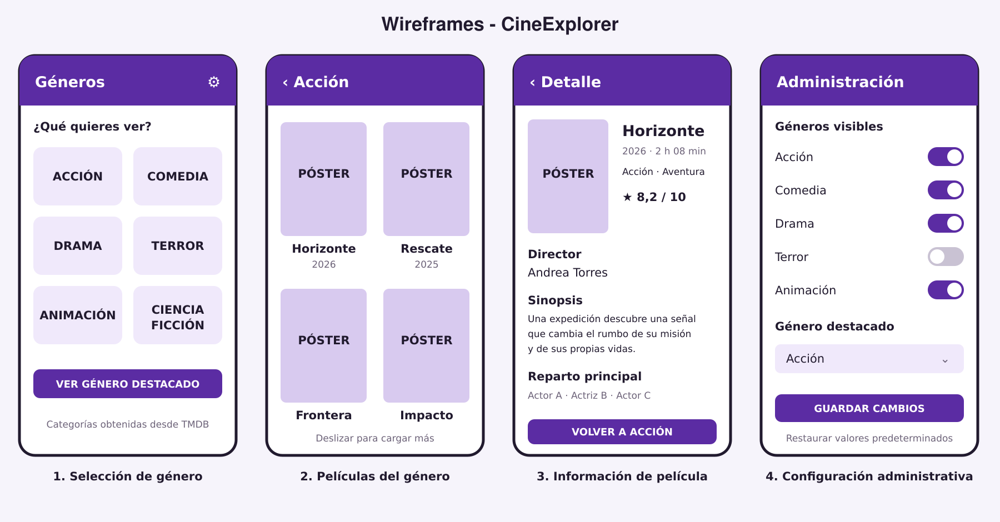
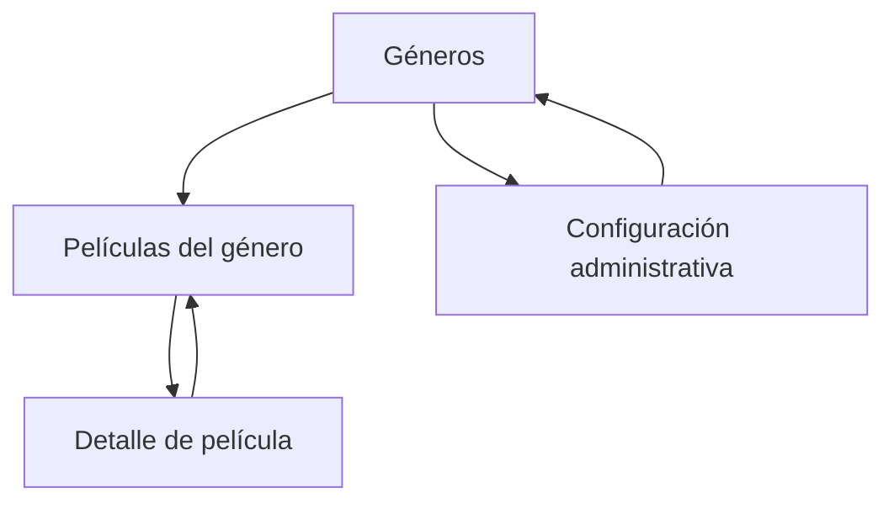

# CineExplorer

> Borrador del proyecto de aplicación Android  
> **Autor:** [Cristian Javier Jamaica]  
> **Curso:** [Desarrollo de Aps Móviles (COM-437ES-AVO1)]  
> **Institución:** [Saint Leo University]  
> **Fecha:** 26 de agosto de 2026

## Tabla de contenido

1. [Descripción del proyecto](#descripción-del-proyecto)
2. [Exposición del problema](#exposición-del-problema)
3. [Objetivos](#objetivos)
4. [Plataforma](#plataforma)
5. [Interfaz de usuario](#interfaz-de-usuario)
6. [Interfaz de administrador](#interfaz-de-administrador)
7. [Funcionalidad](#funcionalidad)
8. [Integración con la API](#integración-con-la-api)
9. [Diseño y wireframes](#diseño-y-wireframes)
10. [Alcance del prototipo](#alcance-del-prototipo)
11. [Referencias](#referencias)

## Descripción del proyecto

**CineExplorer** será una aplicación Android para explorar películas a partir de sus géneros. La pantalla inicial mostrará categorías como acción, aventura, animación, comedia, drama, terror y ciencia ficción. Cuando el usuario seleccione un género, la aplicación presentará las películas correspondientes en una cuadrícula. Al tocar una película, se abrirá una ficha con el título, año de estreno, géneros, director, sinopsis, reparto principal, duración, calificación y póster.

La información se obtendrá de **The Movie Database (TMDB)** mediante su API. El proyecto tendrá un alcance concreto: navegación por géneros, listado de películas, consulta de detalles y una administración básica de los géneros visibles. La aplicación será informativa y no reproducirá ni descargará películas.

## Exposición del problema

Las personas interesadas en el cine pueden tener dificultades para encontrar películas de un género específico y consultar rápidamente su información principal. Los resultados generales de un buscador suelen mezclar noticias, videos, plataformas de transmisión y otros contenidos. Esto obliga al usuario a realizar varias búsquedas para conocer el año, el género, la sinopsis o el director de una película.

CineExplorer reunirá esa información en un recorrido sencillo: **seleccionar un género, consultar sus películas y abrir la ficha de la película elegida**. De esta manera, el usuario podrá descubrir títulos relacionados con sus intereses sin recorrer diferentes sitios. El uso de una API mantendrá el catálogo separado del código de la aplicación y permitirá trabajar con datos cinematográficos reales.

## Objetivos

### Objetivo general

Desarrollar en Android Studio una aplicación móvil que permita explorar películas por género y consultar la información detallada de cada título mediante la API de TMDB.

### Objetivos específicos

- Obtener y mostrar la lista oficial de géneros cinematográficos de TMDB.
- Consultar las películas asociadas con el género seleccionado.
- Mostrar título, póster y año en cada tarjeta de película.
- Presentar una ficha con géneros, director, sinopsis, reparto, duración y calificación.
- Implementar navegación entre géneros, listado y detalle.
- Incluir estados de carga, error y ausencia de resultados.
- Permitir que un administrador seleccione qué géneros se muestran en la pantalla inicial.

## Plataforma

La aplicación se desarrollará para **Android** mediante **Android Studio**. Se utilizará **Kotlin** como lenguaje principal y **Jetpack Compose** para construir la interfaz con componentes de Material Design 3.

Tecnologías previstas:

- **Entorno:** Android Studio.
- **Lenguaje:** Kotlin.
- **Interfaz:** Jetpack Compose y Material Design 3.
- **Arquitectura:** MVVM, para separar pantallas, lógica y acceso a datos.
- **Consumo de API:** Retrofit y Kotlin Coroutines.
- **Imágenes:** Coil, para cargar los pósteres proporcionados por TMDB.
- **Preferencias locales:** DataStore, para guardar los géneros visibles elegidos desde la administración.
- **Control de versiones:** Git y GitHub Classroom.

No se incorporarán autenticación, Firebase, chat, reproducción de películas, pagos ni sincronización entre dispositivos. Estas funciones no son necesarias para demostrar el concepto principal. La clave o token de TMDB se mantendrá fuera del repositorio público mediante una configuración local.

## Interfaz de usuario

La interfaz seguirá un flujo de tres niveles:

1. **Géneros:** pantalla inicial con categorías cinematográficas representadas mediante tarjetas o botones.
2. **Películas del género:** cuadrícula con póster, título y año de las películas correspondientes.
3. **Detalle:** ficha con la información completa de la película seleccionada.

Pantallas principales:

- Pantalla de géneros.
- Lista de películas filtradas por el género seleccionado.
- Pantalla de detalle de una película.
- Pantalla administrativa básica.

La pantalla de listado permitirá regresar a los géneros y cargar más resultados mediante paginación sencilla. Durante una consulta aparecerá un indicador de carga. Si no hay conexión, la API falla o el género no contiene resultados, se mostrará un mensaje claro y un botón para volver a intentar.

## Interfaz de administrador

Para cumplir el requisito de una interfaz administrativa sin aumentar demasiado la complejidad, CineExplorer incluirá una pantalla local de configuración. Desde ella se podrán activar o desactivar los géneros que aparecerán en la pantalla inicial y elegir uno como destacado. La selección se guardará mediante DataStore en el dispositivo.

El administrador no editará las películas, los directores ni los demás datos de TMDB. Tampoco se implementará un sistema completo de usuarios o permisos en este prototipo. La entrada al modo administrativo podrá realizarse desde una opción identificada en el menú de configuración; su finalidad académica será demostrar la separación entre la experiencia de consulta y la configuración del catálogo visible.

Funciones administrativas:

- Consultar la lista de géneros disponibles.
- Activar o desactivar géneros en la pantalla principal.
- Elegir un género destacado.
- Restaurar la selección predeterminada.
- Guardar la configuración local.

## Funcionalidad

### Funciones del usuario

1. Abrir la aplicación y consultar los géneros disponibles.
2. Seleccionar un género.
3. Ver las películas relacionadas con el género elegido.
4. Cargar una página adicional de resultados.
5. Seleccionar una película.
6. Consultar su título, año, géneros, director, sinopsis, reparto, duración, calificación y póster.
7. Regresar al listado o cambiar de género.
8. Reintentar una consulta cuando ocurra un error de conexión.

### Funciones del administrador

1. Abrir la configuración administrativa.
2. Activar o desactivar géneros visibles.
3. Seleccionar un género destacado.
4. Guardar o restaurar la configuración.

### Reglas principales

- La pantalla inicial mostrará únicamente los géneros activados.
- La selección de un género determinará la consulta enviada a TMDB.
- Cada película se identificará mediante el identificador asignado por TMDB.
- La ficha será informativa y no permitirá modificar los datos externos.
- El director se obtendrá de los créditos buscando el trabajo identificado como *Director*.
- La aplicación no reproducirá, descargará ni distribuirá contenido audiovisual.
- Los errores no cerrarán la aplicación; mostrarán una explicación y la opción de reintentar.

## Integración con la API

CineExplorer utilizará la versión 3 de la API de TMDB. Primero solicitará la lista de géneros. Cuando el usuario elija uno, enviará su identificador al endpoint de descubrimiento mediante el parámetro `with_genres`. Después, al abrir una película, consultará sus detalles y créditos para completar la ficha e identificar al director.

Flujo de datos:

1. La aplicación solicita los géneros disponibles.
2. El usuario selecciona un género.
3. Retrofit consulta las películas usando el identificador del género.
4. La respuesta JSON se transforma en objetos de Kotlin.
5. La interfaz muestra las tarjetas de películas.
6. Al seleccionar una tarjeta, se consultan los detalles y créditos.
7. La ficha muestra la información o un estado de error.

Endpoints previstos:

```text
GET https://api.themoviedb.org/3/genre/movie/list
GET https://api.themoviedb.org/3/discover/movie?with_genres={genre_id}
GET https://api.themoviedb.org/3/movie/{movie_id}
GET https://api.themoviedb.org/3/movie/{movie_id}/credits
```

## Diseño y wireframes

Los wireframes representan el recorrido principal y la configuración administrativa.



### Flujo de navegación



### Criterios visuales

- Tarjetas amplias y legibles para seleccionar géneros.
- Cuadrícula de dos columnas para los pósteres.
- Título del género seleccionado en la barra superior.
- Ficha organizada por título, director, datos técnicos y sinopsis.
- Indicadores para carga, error y ausencia de resultados.
- Interruptores claros para activar o desactivar géneros en administración.

## Alcance del prototipo

El producto mínimo viable estará completo cuando el usuario pueda abrir la aplicación, seleccionar un género, consultar sus películas y abrir una ficha con la información de una película. También deberá funcionar la selección local de géneros visibles desde la pantalla administrativa. El proyecto mantendrá un nivel intermedio porque integra una API real, navegación, varias consultas relacionadas, transformación de JSON, carga de imágenes, paginación, arquitectura MVVM, persistencia de preferencias y manejo de errores, sin añadir servicios que no sean necesarios para su propósito principal.

## Referencias

- Android Developers. (s. f.). *Meet Android Studio*. https://developer.android.com/studio/intro
- GitHub. (s. f.). *Hola mundo*. https://docs.github.com/es/get-started/using-github/hello-world
- Sánchez Hernández, J. J. (s. f.). *Taller de introducción a Git y GitHub*. GitHub. https://github.com/josejuansanchez/taller-git-github
- The Movie Database. (s. f.). *Getting started*. https://developer.themoviedb.org/docs/getting-started
- The Movie Database. (s. f.). *Discover movies*. https://developer.themoviedb.org/reference/discover-movie
- The Movie Database. (s. f.). *Movie credits*. https://developer.themoviedb.org/reference/movie-credits
